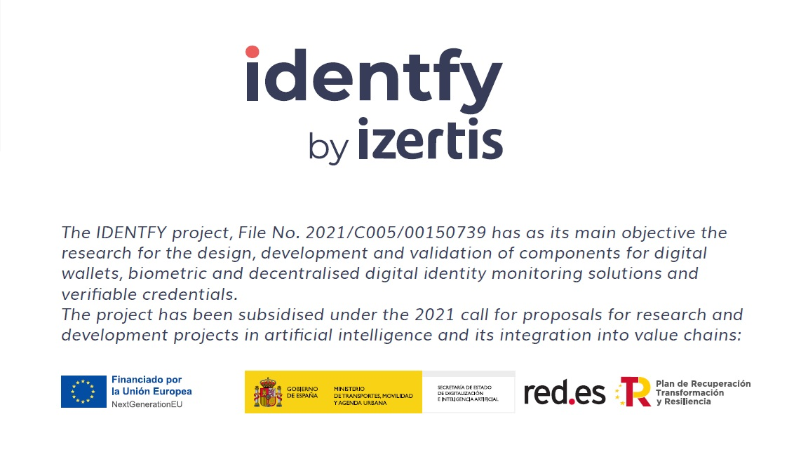

    <picture>
      
    </picture>

  <h4>
    An all-in-one solution to take control of your digital identity
  </h4>

 

#  identfy Entity service

## Considerations

Although the service is technically stateless, the protocol itself is not, since it requires storing certain information about the user's session. Consequently, the service relegates these responsibilities to other entities, which it contacts via HTTP requests. Thus, in order for the service to function correctly, it is necessary to have one or more entities, depending on how it is considered, to fulfill these responsibilities.

## Prerequisites

### Identity and cryptographic key management

The microservice is designed to be used by varying the cryptographic material to be used by the Issuer. Thus, if a method requires a signature, it will be necessary to pass the cryptographic keys to be used to the microservice together with the request that originates the call to the aforementioned method. The format of the keys will be JWK and the communication will be done through REST API. This condition means that the service cannot or should not be directly consumed by users, but is intended to be consumed by a so-called BackOffice that handles identity management and the underlying key management. In this way, the service becomes an assistive component, in charge of constructing the requests and responses to be delivered to the Holder Wallet, while the BackOffice acts as a pass-through or, depending on how it is considered, as a reverse proxy.

Additionally, the same treatment is also given to the DIDs to be used and the external address itself, which the service should include in the data structures it generates.

It is recommended to consult the REST API of the service to determine exactly which of these elements are required depending on the different endpoints that are proposed.

## Build

Node version 16 is required to operate the service.

Clone the repository and install the dependencies with:

`npm install`

Run the server with:

`npm run serve`

### Docker

Clone the repository and create an image for the service using the Dockerfile located in the root of the project.
`docker build . -t identfy-service`

Once the docker image is created, you can deploy a container by specifying the desired configuration. In the case of requiring configuration by file, the dockerfile will include the files indicated in the "deploy" directory, so you can modify them if desired. Additionally, it is also possible to mount a volume and host the configuration files in it.

### Docker-compose

Clone the repository and use docker-compose to create a container of the service using the file located in the `deploy` directory. You do not need to create the image first, as it is configured to do so. To do so, run the following command:

`docker-compose up`

By default you will use the local environment configuration, based on the [local configuration file](./deploy/config/local.yaml)

## Configuration and code overview

There is a deeper explanation of the [configuration and code overview](./IDENTFY_SERVICE_TECH_OVERVIEW.md)

## Code of contribution

Read please the [contribution documentation](../CONTRIBUTING.md)